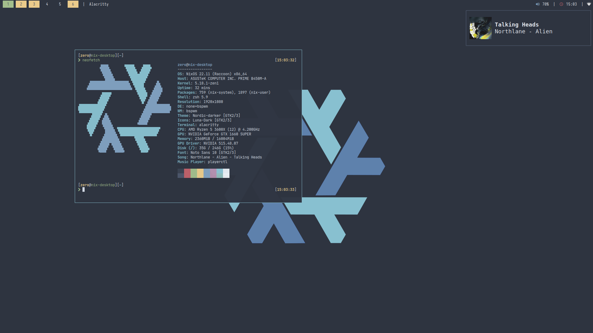
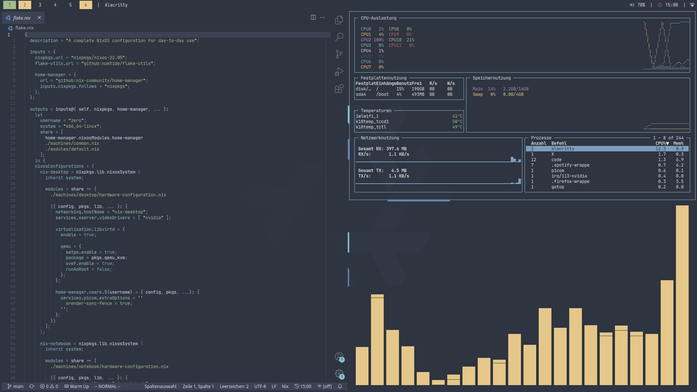

# Nixfiles - A full desktop, powered by Nix





## Install

0. Follow the [NixOS installation manual](https://nixos.org/manual/nixos/stable/) up until chapter 2.3

1. Use the repo as a [template](https://github.com/TonyTheAce/open-dots/generate) and clone it

```
$ nix-env -iA nixos.git
$ git clone REPO
```

2. Generate `hardware-configuration.nix` inside a folder of the `machines` directory

```
$ cd REPO
$ mkdir ./machines/HOSTNAME
$ nixos-generate-config --root /mnt --dir ./machines/HOSTNAME
$ rm ./machines/HOSTNAME/configuration.nix
```

4. Edit `./modules/` and `machines/common.nix` for localization/username/etc.

5. Edit `flake.nix` (See examples: `nix-laptop` and `nix-notebook`)

6. Add your changes, a commit is optional

```
git add .
```

7. Install with `# nixos-install --flake .#HOSTNAME`, type a root password and reboot

8. After login, clone the repo into `$HOME`, e.g. into `$HOME/.nix` for updates/changes

## Components

Component|Usage|Notes
---------|-----|-----
`NixOS + flakes + home-manager`|Operating system|See resources below
`zsh + starship`|Shell|
`neovim`|Editor|`nano` is always installed
`bspwm`|Window manager|
`sxhkd`|Hotkey manager|
`picom`|Compositor|Can cause performance loss
`alacritty`|Terminal emulator|Access with `super + enter`
`polybar`|Status bar|If workspaces are missing, reload with `ctrl + alt + r`
`rofi`|Launcher/Calculator/File browser|
`ranger`|CLI file browser|
`thunar`|GUI file browser|

## Quirks

- Aliases are found in `env.nix`

- Define your git config in `modules/home-manager/pkgs/git.nix`

- Username is defined in `flake.nix` and `modules/default.nix`. Default is `zero`

- The default password is `nixfiles`. Change it with `passwd` after the first login when installed

## Resources

- [Official documentation](https://nixos.org/learn.html)

- [Unofficial wiki](https://nixos.wiki/)

- [Home-manager manual](https://rycee.gitlab.io/home-manager/)

- [awesome-nix](https://github.com/nix-community/awesome-nix)

- [Package/option search for NixOS](https://search.nixos.org)


